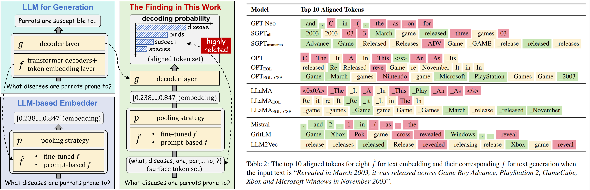
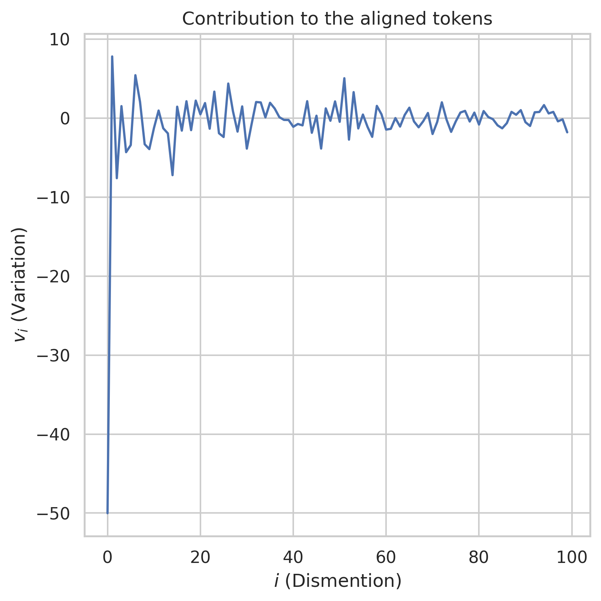
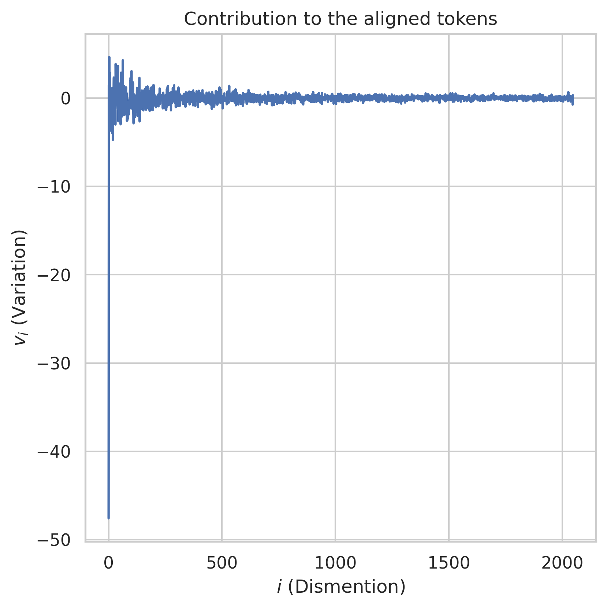
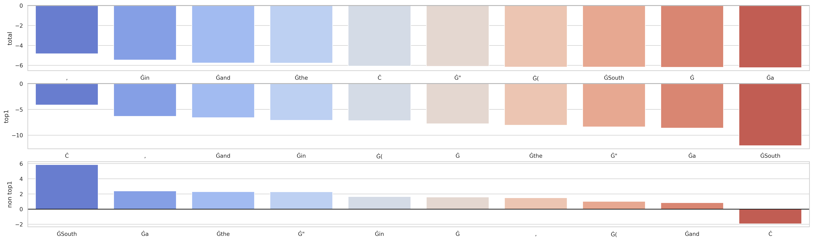
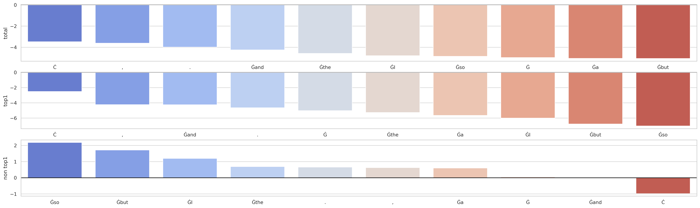
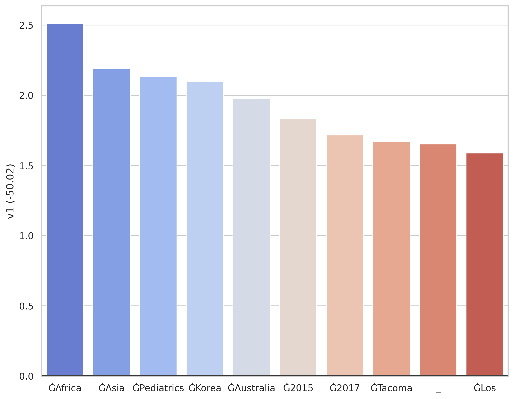
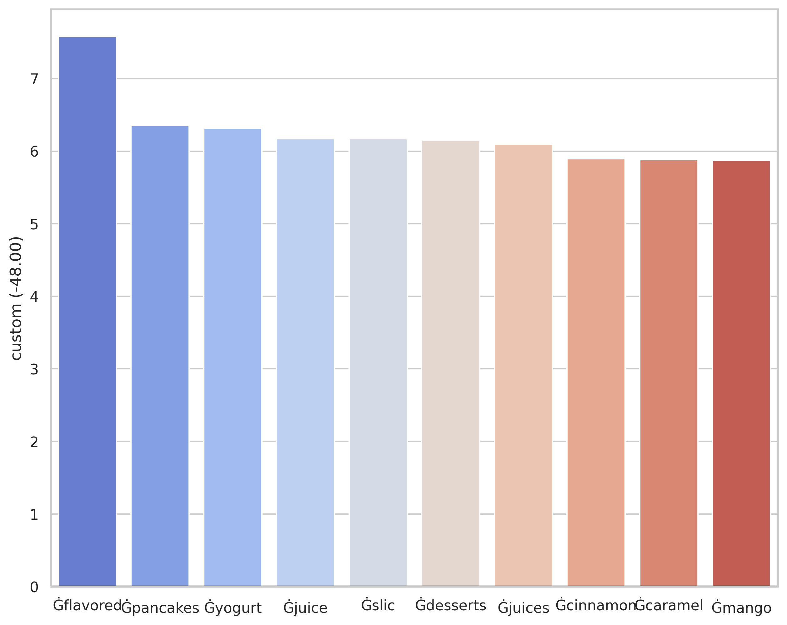

# A Text is Worth Several Tokens
The official code implementation of the ACL2025 paper “[A Text is Worth Several Tokens: Text Embedding from LLMs Secretly Aligns Well with The Key Tokens](https://arxiv.org/abs/2406.17378)”.

### Overview



### Environment Configuration

```bash
conda env create -f environment.yml -n your_new_environment_name
```

⚠️ If you are in Mainland China, you need to configure a mirror to access Huggingface

```bash
export HF_ENDPOINT=https://hf-mirror.com
```

### Quick Start

Run the following command to produce an `.xlsx` file that lists each original sentence alongside the tokens aligned to its embeddings.

```bash
python aligned_token.py
```

Set `$model` and `$dataset` with different values to evaluate different embedders across various datasets.

```bash
python aligned_token.py --model=$model --dataset=$dataset
```

Note: download the `wiki` and `nli` datasets in advance from the [link](https://huggingface.co/datasets/princeton-nlp/datasets-for-simcse/tree/main) if you need them. The placement path is `data/wiki/wiki1m_for_simcse.txt` and `daya/nli/nli_for_simcse.csv` .

#### Support LLM-based Embedders

| --model                 | Corresponding Model                                          |
| ----------------------- | ------------------------------------------------------------ |
| `gpt_neo`               | `EleutherAI/gpt-neo-1.3B`                                    |
| `sgpt_nli`              | `Muennighoff/SGPT-1.3B-weightedmean-nli`                     |
| `sgpt_msmarco`          | `Muennighoff/SGPT-1.3B-weightedmean-msmarco-specb-bitfit`    |
| `opt`                   | `facebook/opt-1.3b`                                          |
| `opt_eol`               | `facebook/opt-1.3b`                                          |
| `opt_eol_cse`           | `royokong/prompteol-opt-1.3b`                                |
| `llama`                 | Fill out Meta's [official form](https://docs.google.com/forms/d/e/1FAIpQLSfqNECQnMkycAp2jP4Z9TFX0cGR4uf7b_fBxjY_OjhJILlKGA/viewform) for weights |
| `llama_eol`             | Fill out Meta's [official form](https://docs.google.com/forms/d/e/1FAIpQLSfqNECQnMkycAp2jP4Z9TFX0cGR4uf7b_fBxjY_OjhJILlKGA/viewform) for weights |
| `llama_eol_cse`         | `royokong/prompteol-llama-7b`                                |
| `llama2`                | `meta-llama/Llama-2-7b-chat-hf`                              |
| `llama2_eol`            | `meta-llama/Llama-2-7b-chat-hf`                              |
| `mistral`               | `mistralai/Mistral-7B-Instruct-v0.2`                         |
| `gritlm`                | `GritLM/GritLM-7B`                                           |
| `llm2vec_mistral_sup`   | `McGill-NLP/LLM2Vec-Mistral-7B-Instruct-v2-mntp`+<br />`McGill-NLP/LLM2Vec-Mistral-7B-Instruct-v2-mntp-supervised` |
| `llm2vec_mistral_unsup` | `McGill-NLP/LLM2Vec-Mistral-7B-Instruct-v2-mntp`+<br />`McGill-NLP/LLM2Vec-Mistral-7B-Instruct-v2-mntp-unsup-simcse` |
| `e5_mistral`            | `intfloat/e5-mistral-7b-instruct`                            |

We also offer support for several embedders built on non-Transformer decoder architectures. However, as noted in the **Limitations** section, not every lightweight embedder exhibits the “alignment to key tokens” phenomenon. Accordingly, the final column records the behavior we actually observed for each model.

| --model             | Corresponding Model in HF                                    | Aligned with Key Tokens? |
| ------------------- | ------------------------------------------------------------ | ------------------------ |
| `bert`              | `bert-base-uncased`                                          | ❌                        |
| `prompt_bert`       | `bert-base-uncased`                                          | ✅                        |
| `prompt_bert_sup`   | `royokong/sup-PromptBERT`                                    | ✅                        |
| `prompt_bert_unsup` | `royokong/unsup-PromptBERT`                                  | ✅                        |
| `simcse`            | `princeton-nlp/sup-simcse-bert-base-uncased`                 | ❌                        |
| `sentence_t5`       | `sentence-transformers/sentence-t5-large`                    | ❌                        |
| `contriever`        | `facebook/contriever`                                        | ❌                        |
| `dpr`               | `facebook/dpr-question_encoder-single-nq-base`+<br />`facebook/dpr-ctx_encoder-single-nq-base` | ✅                        |
| `gte`               | `thenlper/gte-base`                                          | ❌                        |
| `e5`                | `intfloat/e5-base-v2`                                        | ❌                        |
| `mpnet`             | `sentence-transformers/all-mpnet-base-v2`                    | ✅                        |
| `spider`            | `tau/spider`                                                 | ✅                        |

#### Support Dataset

| --dataset | Corresponding Dataset in HF         |
| --------- | ----------------------------------- |
| `sts`     | `princeton-nlp/datasets-for-simcse` |
| `nli`     | `princeton-nlp/datasets-for-simcse` |
| `msmarco` | `microsoft/ms_marco`                |
| `wiki`    | `princeton-nlp/datasets-for-simcse` |

### Spectral Analysis

#### 1. Variation in each principal component

For a quick start, you can run:

```bash
python spectral_analyze.py --analyze_type=variation
```



This figure is slightly different from the one reported in the paper because we only used 100 samples for the SVD decomposition.

If more precise results are needed, a larger sample size can be selected using the `data_size` field.

```bash
python spectral_analyze.py --analyze_type=variation --data_size=10000
```



#### 2. Contribution of different components to aligned tokens

For a quick start, you can run:

```bash
python spectral_analyze.py --analyze_type=contribution
```

Then you can get a figure as follows:



This image draws the text `YMCA in South Australia` by default.

The `text` field can be used to modify the text to be analyzed:

```bash
python spectral_analyze.py --analyze_type=contribution --text="I like apple and banana"
```



#### 3. Subtraction of the certain amount on the first principal component

For a quick start, you can run:

```bash
python spectral_analyze.py --analyze_type=change
```

Then you can get a figure as follows:



This image draws the text `YMCA in South Australia` and $v_1$ calculated by the first step by default

The `text`, `lambda_type` and `lambda_value` field can be used to modify the default setting.

```bash
python spectral_analyze.py --analyze_type=change --text="I like apple and banana" --lambda_type=custom --lambda_value=-48.0
```


